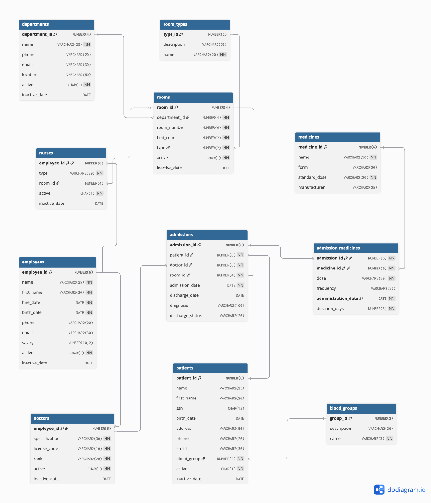

# Hospital Admission Management Database


Oracle SQL/PL/SQL project focused on the full **patient admission lifecycle** — admission, treatment, and discharge — with business rules enforced at the database layer so invalid states are blocked even if application code is bypassed.

## Database Schema



The schema covers:

| Category | Tables |
|---|---|
| Clinical | `patients`, `blood_groups` |
| Organisation | `departments`, `rooms`, `room_types` |
| Staff | `employees`, `doctors`, `nurses` |
| Admission flow | `admissions`, `medicines`, `admission_medicines` |

## Business Rules Enforced

| Rule | Mechanism |
|---|---|
| Admissions only allowed with active patient, doctor, and room | `BEFORE INSERT` row trigger |
| Room capacity cannot be exceeded | Compound trigger (collects rows, checks after statement) |
| Medicine administration must fall within the admission window | `BEFORE INSERT/UPDATE` row trigger |
| Discharge blocked if any medication plan is still active | `BEFORE UPDATE` row trigger + discharge procedure |
| ICU patients must stay a minimum of 3 days | Discharge procedure with user-defined exception |
| An employee cannot be both a doctor and a nurse | Mutual `BEFORE INSERT` row triggers |
| Core tables cannot be dropped | Schema-level `BEFORE DROP` DDL trigger |
| Deactivating an employee cascades to their doctor/nurse record | `AFTER UPDATE` row trigger |
| Deactivating a department cascades to its rooms | `AFTER UPDATE` row trigger |
| Direct `DELETE` on critical tables is blocked (soft-delete only) | `BEFORE DELETE` row triggers |

## Repository Structure

```
.
├── create.sql           # Schema (tables + constraints), core triggers, seed data
├── procedures.sql       # finalize_discharge — validates and applies discharge
├── functions.sql        # get_latest_admission_doctor — returns supervising doctor
├── cursors.sql          # report_doctors_by_department — cursor-based reporting
├── collections.sql      # generate_patient_medical_report — PL/SQL collections
├── packages.sql         # pkg_medical_management — reusable admission operations
├── r_lmd_trigger.sql    # Row-level triggers: doctor/nurse role exclusivity
├── c_lmd_trigger.sql    # Statement-level trigger: post-DML occupancy report
├── ldd_trigger.sql      # Schema-level DDL trigger: DROP protection
└── assets/
    └── conceptual_diagram.png
```

## Environment

- Oracle Database 21c Free (or compatible)
- PDB: `FREEPDB1`
- SQL\*Plus or SQL Developer

### Local setup with Docker

Pull and start an Oracle Free container:

```bash
docker run -d \
  --name oracle-free \
  -p 1521:1521 \
  -e ORACLE_PASSWORD=yourpassword \
  container-registry.oracle.com/database/free:latest
```

Wait until the container is healthy (check with `docker logs oracle-free`), then create a dedicated application user inside the PDB. Connect first as SYSTEM:

```bash
sqlplus system/yourpassword@//localhost:1521/FREEPDB1
```

Then create the user and grant the necessary privileges:

```sql
CREATE USER app_user IDENTIFIED BY yourpassword
  DEFAULT TABLESPACE users
  TEMPORARY TABLESPACE temp
  QUOTA UNLIMITED ON users;

GRANT CONNECT, RESOURCE TO app_user;
GRANT CREATE SESSION,
      CREATE TABLE,
      CREATE VIEW,
      CREATE SEQUENCE,
      CREATE PROCEDURE,
      CREATE TRIGGER,
      CREATE TYPE,
      ADMINISTER DATABASE TRIGGER  -- required for schema-level DDL triggers
TO app_user;
```

Reconnect as the application user:

```bash
sqlplus app_user/yourpassword@//localhost:1521/FREEPDB1
```

This user has full permissions over its own schema but cannot see Oracle system tables or other schemas — which keeps the environment clean and matches how the scripts were written.

## How to Run

Execute scripts in this order — each depends on the schema created by the previous one:

```sql
@create.sql
@procedures.sql
@functions.sql
@cursors.sql
@collections.sql
@packages.sql
@r_lmd_trigger.sql
@c_lmd_trigger.sql
@ldd_trigger.sql
```

Each script includes a `SET SERVEROUTPUT ON` test block that runs automatically and prints pass/fail results.

### Full reset

To drop all tables and start fresh, temporarily disable the DDL protection trigger:

```sql
ALTER TRIGGER trg_protect_drop_tables DISABLE;

DROP TABLE admission_medicines CASCADE CONSTRAINTS;
DROP TABLE admissions         CASCADE CONSTRAINTS;
DROP TABLE nurses             CASCADE CONSTRAINTS;
DROP TABLE doctors            CASCADE CONSTRAINTS;
DROP TABLE employees          CASCADE CONSTRAINTS;
DROP TABLE rooms              CASCADE CONSTRAINTS;
DROP TABLE departments        CASCADE CONSTRAINTS;
DROP TABLE patients           CASCADE CONSTRAINTS;
DROP TABLE medicines          CASCADE CONSTRAINTS;
DROP TABLE room_types         CASCADE CONSTRAINTS;
DROP TABLE blood_groups       CASCADE CONSTRAINTS;

ALTER TRIGGER trg_protect_drop_tables ENABLE;
```

## Test Coverage

Each script contains self-contained test blocks that validate both expected success and expected failure paths.

| Script | Cases tested |
|---|---|
| `procedures.sql` | Valid discharge; incomplete medication plan (blocked); ICU minimum stay (blocked); inactive entity (blocked); non-existent admission |
| `functions.sql` | Valid patient; `NO_DATA_FOUND`; `TOO_MANY_ROWS` on duplicate last name |
| `cursors.sql` | Year with admissions; year with no admissions |
| `collections.sql` | Existing patient SSN; missing SSN |
| `packages.sql` | Bed availability; duration calculation; new admission; medicine assignment; admission details report |
| `r_lmd_trigger.sql` | Valid doctor insert; blocked nurse on same employee; valid nurse insert; blocked doctor on same employee |
| `c_lmd_trigger.sql` | Single insert; multiple inserts; update; single delete; multiple deletes |
| `ldd_trigger.sql` | DROP on unprotected table (allowed); DROP on protected table (blocked) |
